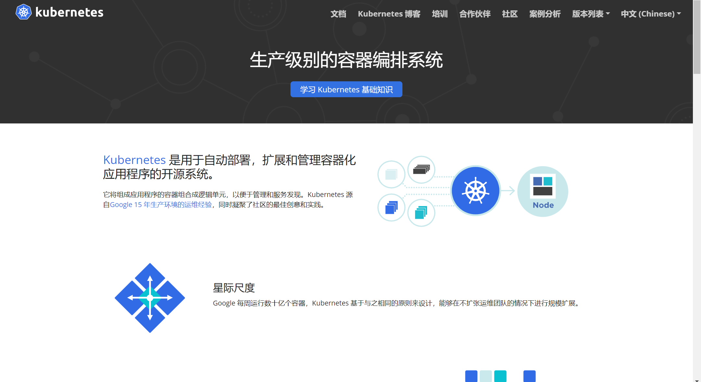
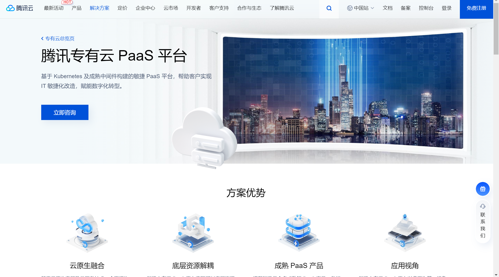
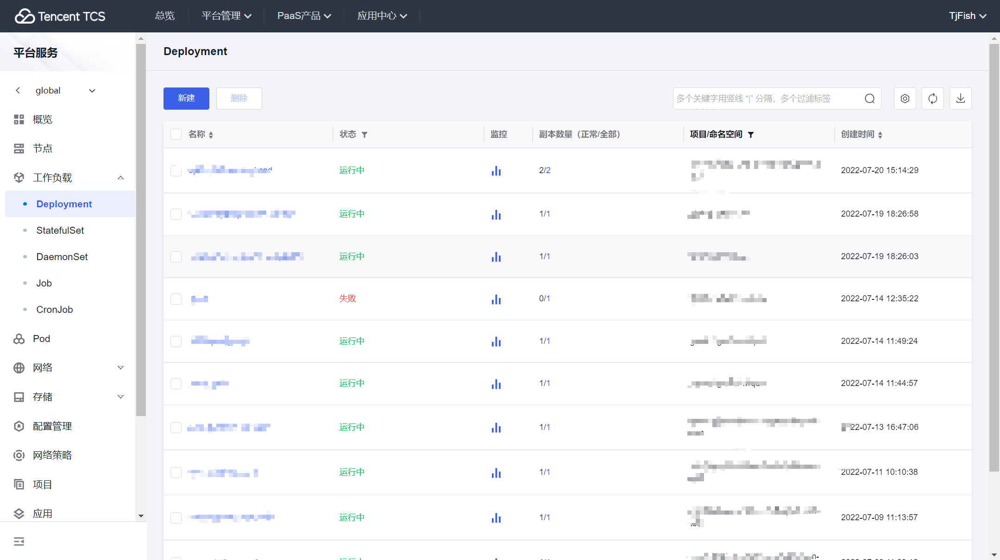
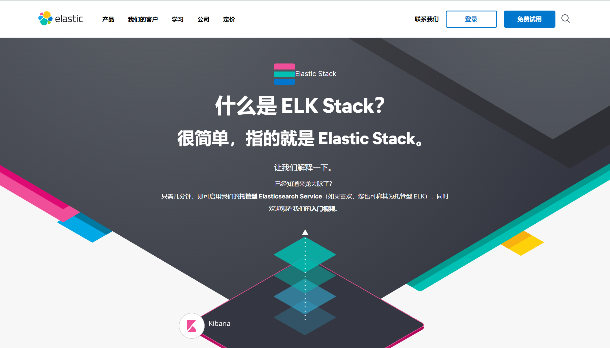
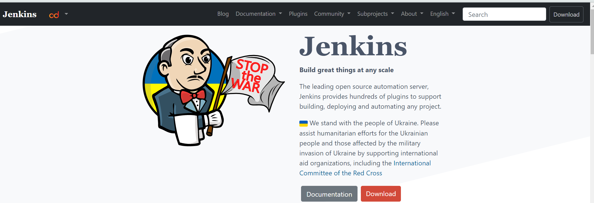
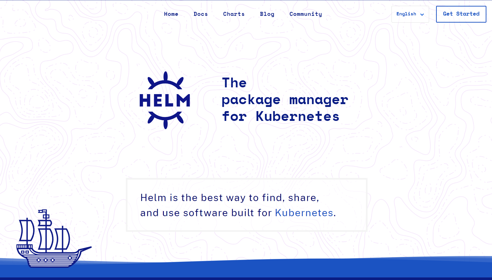

# 尝试k8s

同济大学信息办向腾讯采购了tcs平台，由于我在帮信息办老师干活，所以有幸被邀请参加tcs平台的测试，去部署同济信息开放平台等项目。在这里把这一个多月的工作做一下记录。对于我而言，也是第一次接触k8s，之前从未真正地去操作过分布式集群部署。特别这次可以直接去操作学校的20多台机器，内心还是很兴奋的。

## 腾讯TCS平台

腾讯tcs平台是一个基于 Kubernetes 及成熟中间件构建的敏捷 PaaS 平台，用来管理的k8s和各类中间件的一个统一服务。之前虽然使用过docker，知道一些镜像容器部署的概念，但k8s相当于在docker基础上再提升一层，是用来管理多个docker容器，多个主机的平台服务。

随着对tcs平台和k8s了解的深入，逐渐发现tcs平台其实就是对k8s做了一个前端页面服务，让用户可以可视化的形式去配置各类服务和应用。在使用过程中发现tcs平台前端存在许多小bug，有些还挺影响体验的。比如配置deployment时，有些很重要的配置没法在前端配置，只能通过手动改yaml文件来实现。还有时候修改yaml文件没法正确保存，前端配置的和yaml文件配置的会产生冲突，有时候挺烦人的。不过tcs平台能以前端形式展示出所有服务，应用，网络配置这些，就已经挺节省时间了。其次tcs平台还集成了一些常用的中间件，比如日志服务，镜像仓库服务，这些挺不错的。

## 服务部署

我从最基础的springboot java项目开始，逐渐在tcs平台上部署了

- 基于**krakend**的同济信息开放网关
- 基于**ELK**的统一日志中心
- 基于**jenkins**的自动化部署服务
- 基于**springboot**的后端项目

部署过程中由于对这些中间件，对k8s不熟悉，几乎每一个服务都是新接触的，需要多次翻阅官方文档，查找大量资料。这中间也有遇到一些很蛋疼的问题，出现过一直配置不成功的情况。

虽然说这些部署过程是我在帮学校打工，但其实换个角度说也是学校交学费让我免费学习。如果没有这次机会，我或许之后很难接触到k8s，云平台这些服务。回想起我之前在字节跳动实习时，都是直接使用公司提供的中间件和云平台。对我而言基本只有部署、回滚两个按钮，背后的原理一概不知。这次机会让我好好的学习一番，有机会去尝试分布式平台和云原生服务，了解背后的原理，着实发现了一片新天地。

## 后续打算

现在遇到的问题是有大量的yaml配置文件需要管理，这些文件有些是直接在tcs前端页面部署的，没有编写yaml文件。有些是通过yaml文件部署的。这些文件如何管理，如何维护和升级是我最近在思考的问题。

后续打算学习下Helm。Helm相当于k8s的包管理软件，可以将现有服务配置成一个个应用，统一管理各个应用的配置文件。通过Helm可以大量减少配置文件管理的难度，也方便后续服务更新和维护。之后把项目交接给其他老师同学时也较少沟通和学习成本。

