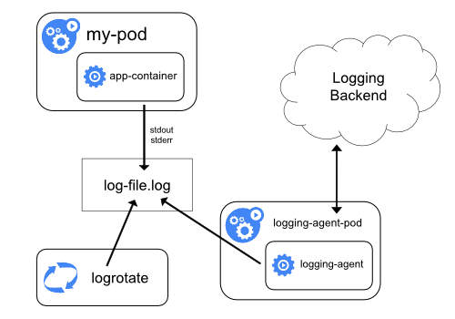
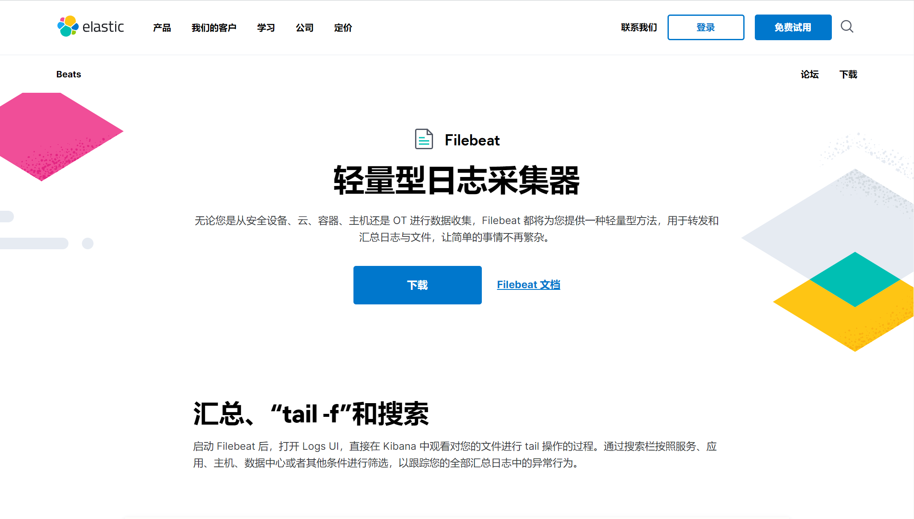
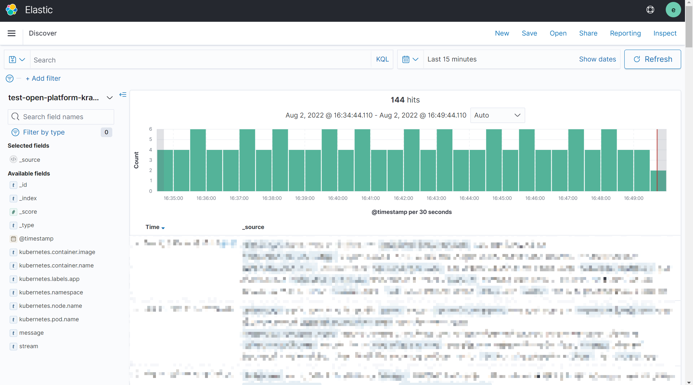
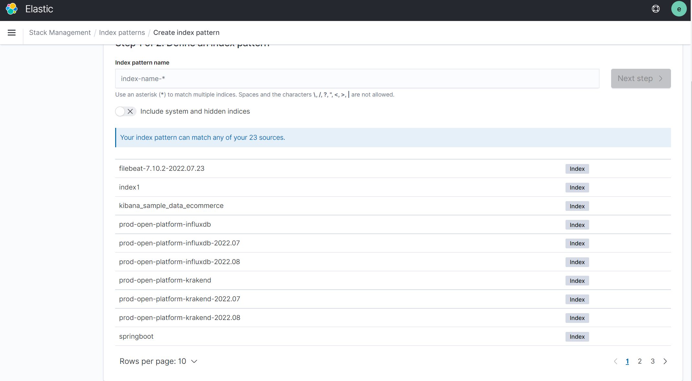

```
title: k8s-日志采集框架搭建
date: 2022-07-22
categories: [k8s]
tags: [k8s]   
img_path: /assets/img/
```

学校信息办需要搭建统一的日志中心，将大部分服务的日志都迁移到日志中心上来。之前查看日志都是登录到应用部署的机器上，手动查看日志文件，很不方便。有了日志中心后，可以在一处查看所有服务的日志，方便运维管理，快速排查问题。这些天基于ELK+Filebeat在k8s集群上搭建了一套日志采集+日志存储+日志检索的日志中心服务，整个中间也遇到了很多问题，也学到了许多，在此做些记录。

# 日志采集架构

k8s官方提供了三种日志采集的解决方案，分别是节点日志采集代理，以 sidecar 容器收集日志，直接从应用程序收集日志。

### 节点日志采集代理

这种方案是在k8s每个节点都部署一个日志采集代理，节点上运行的容器将日志输出到文件，然后日志采集代理分析收集日志文件，并发送给远端的日志系统，比如Elasticsearch。

常见的日志采集代理有Logstash，Filebeat，Flunetd。可以参考[日志采集代理的对比](https://blog.csdn.net/adparking/article/details/119565447)。



### 以 sidecar 容器收集日志

在应用部署的同一个pod下部署日志采集代理收集应用产生的日志。和节点日志采集不同，这个粒度更细，但操作起来更繁琐。


### 直接从应用程序收集日志

最后一种是让应用重新直接将发送日志到日志系统，比如通过tcp、udp协议。但这种方案对应用程序性能有影响，应用程序端有感知，产生耦合。


# Filebeat日志采集

[Filebeat](https://www.elastic.co/cn/beats/filebeat)是一款轻量型日志采集器，相比于logstash需要消耗500M左右内存，Filebeat只需要10M左右内存就可以完成工作。Filebeat和Elasticsearch的结合也非常不错。

在我们的方案中选择Filebeat在节点级别做日志采集代理。



## Filebeat部署配置

Filebeat如何在k8s上部署，官方文档给出了[教程](https://www.elastic.co/guide/en/beats/filebeat/7.10/running-on-kubernetes.html)。

官方教程以DaemonSet形式部署Filebeat。DaemonSet是在k8s每个节点上都会运行相同的容器，只需要在一处配置，就可以覆盖所有节点。非常适合我们节点级日志采集方案，

按照官方教程走基本没有问题，但我部署时遇到几个坑记录下。

### 连接不上ES

最开始部署的时候，Filebeat一切正常，单看日志没有任何问题，但是在Elasticsearch搜不到日志。

出现这种情况，可以用下面命令测试Filebeat 的输出是否正常。首先进入Filebeat部署的容器，默认在fielbeat的安装目录。执行下面命令

```shell
filebeat test output
#可以看到输出，下面表示链接正常
elasticsearch: https://xxxx:15003...
  parse url... OK
  connection...
    parse host... OK
    dns lookup... OK
    addresses: xxxx
    dial up... OK
  TLS...
    security... WARN server's certificate chain verification is disabled
    handshake... OK
    TLS version: TLSv1.3
    dial up... OK
  talk to server... OK
  version: 7.10.2
```

如果链接不上，会给出报错信息，可以据此搜索解决。


除此之外，第一次配置建议将Filebeat的日志级别改为Debug（默认为info），这样可以帮助我们很快的排查问题。具体设置如下：

在filebeat.yml文件中加上一行

```
logging.level: debug
```

### Filebeat版本不对

Filebeat的版本需要和Elasticsearch保持一致。我在部署时，Elasticsearch使用的是7.10.2的版本，而Filebeat选择了最新版8.3，就会导致如下错误。将Filebeat换成同样换成7.10.2的版本就没有这个问题了。

```
{"error":{"root_cause":[{"type":"invalid_index_name_exception","reason":"Invalid index name [_license], must not start with '_'."
```

还需要注意的是，Filebeat分为商业版和社区版（后缀带OSS），如果Elasticsearch使用的社区版，那么Filebeat就只能使用社区版。使用商业版会提示以下错误：

```
Connection marked as failed because the onConnect callback failed: Filebeat requires the default distribution of Elasticsearch. Please update to the default distribution of Elasticsearch for full access to all free features, or switch to the OSS distribution of Filebeat.
```

### 容器日志不在标准位置

Filebeat报错找不到文件 No such file or directory，但进入容器后ls查看，发现目录下存在文件，百思不得其解。

这可能的原因是容器日志并未输出在默认位置/var/lib/docker/containers，而是被移动到其他目录下。而filebeat在pod收集的日志文件，需要通过软链接的方式，指向到/var/lib/docker/containers目录中。导致日志文件没有被挂载到filebeat pod中，软链接指向到了一个不存在的文件。

这可以通过查看日志文件实际软连接的位置来确定。具体命令如下：查看软连接实际指向位置

```
namei /var/log/containers/xxx.log
```

然后修改filebeat的挂载目录，挂载日志实际指向目录。

可以参考https://blog.csdn.net/zss_89/article/details/122232538

## Filebeat 配置文件设置

我希望实现只收集属于我的项目的日志，根据环境不同输出到Elasticsearch的不同index。测试环境以test开头，生产环境以prod开头。参考[官网文档](https://www.elastic.co/guide/en/beats/filebeat/7.10/index.html)设置

### processss配置

下方配置主要添加了kubernetes相关的元数据，然后去掉了一些无用字段。通过kubernetes元数据，可以根据命名空间和部署应用名不同来输出到不同的index中。

```yml
    processors:
      - add_kubernetes_metadata:
          host: ${NODE_NAME}
          matchers:
          - logs_path:
              logs_path: "/var/log/containers/"    
      #删除的多余字段
      - drop_fields:
          fields: ["host", "tags", "ecs", "log", "prospector", "agent", "input", "beat", "offset"]
          ignore_missing: true
      - drop_fields:
          fields: ["kubernetes.pod.uid","kubernetes.namespace_uid","kubernetes.namespace_labels",
                   "kubernetes.node.uid","kubernetes.node.labels","kubernetes.replicaset",
                   "kubernetes.labels.pod-template-hash","kubernetes.labels.tcs_region","kubernetes.labels.tcs_zone"]
          ignore_missing: true
      - drop_fields:
          fields: ["container"]
          ignore_missing: true
```

### indexs配置

可以通过indices配置，以任意日志中的数据项作为筛选，输出到不同的index中。比如下方，通过判断`kubernetes.namespace`命名空间来设置不同前缀。

```yml
    output.elasticsearch:
      hosts: ['https://${ELASTICSEARCH_HOST:elasticsearch}:${ELASTICSEARCH_PORT:9200}']
      username: ${ELASTICSEARCH_USERNAME}
      password: ${ELASTICSEARCH_PASSWORD}
      indices:
        - index: "test-%{[kubernetes.labels.app]}"
          when.equals:
            kubernetes.namespace: "open-platform-test"
        - index: "prod-%{[kubernetes.labels.app]}"
          when.equals:
            kubernetes.namespace: "open-platform"
```

# 最终效果

花费了几天时间，不断查找资料终于实现了比较满意的结果。最终效果可以在Kibana页面统一查看所有服务的日志。每个服务按照环境分开单独生成一份日志index。由于日志数量不大，暂定每个月进行一次分片，后续观察日志的大小再做调整。





