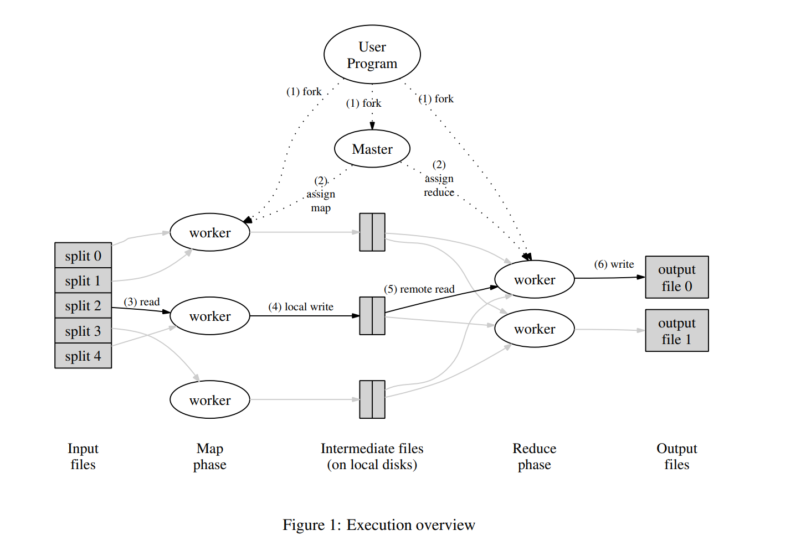
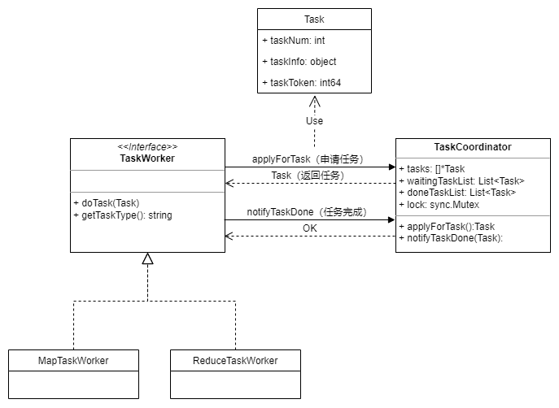
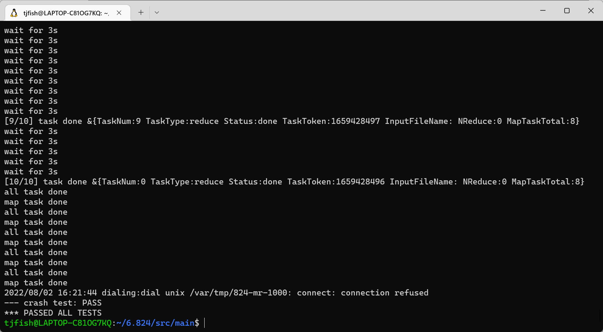

```
title: 分布式-MapReduce
date: 2022-08-01
categories: [分布式]
tags: [分布式]   
img_path: /assets/img/
```

最近暑假在家有空，跟着[MIT分布式系统课程]( https://pdos.csail.mit.edu/6.824/index.html)学一学分布式系统，顺便跟着课程实验学一学go，希望能在开学前学完吧。

## 分布式系统介绍

分布式系统：多台计算机合作提供服务。

为什么要构建分布式系统？

- 通过并行增加处理容量
- 通过复制来容忍故障
- 通过隔离实现安全
- 和现实世界物理设备（例如传感器）的分布相匹配

分布式系统的困难？

- 许多并发部分，复杂的交互过程
- 必须容忍部分机器的故障
- 性能受限

本门课程的主要内容：

- 故障容忍（fault tolerance）
- 分布式一致性（consistency）
- 性能目标（performance）
- 权衡（tradeoffs）
- 代码实现（implementation）

## MapReduce介绍

论文链接 https://pdos.csail.mit.edu/6.824/papers/mapreduce.pdf

### MapReduce简单理解

一个MapReduce例子（统计字母出现的次数）：

```
Input1 -> Map -> a,1 b,1
  Input2 -> Map ->     b,1
  Input3 -> Map -> a,1     c,1
                    |   |   |
                    |   |   -> Reduce -> c,1
                    |   -----> Reduce -> b,2
                    ---------> Reduce -> a,2
```

使用者角度理解：

1. 初始条件：用户需要提供两个函数：Map函数和Reduce函数，Map函数将大数据文件计算后分为多个桶，Reduce函数是将多个桶的结果聚合起来。

    ```
    Map (k1,v1) → list(k2,v2) 
    
    Reduce (k2,list(v2)) → list(v2)
    ```

2. 输入事先被分为M份文件。MR框架将每一份文件作为Map函数的输入，输出<k2,v2>的中间数据。

3. MR框架聚集所有k2相同的的中间数据交由Reduce函数执行，得到<k2,v3>的输出。

### MapReduce流程

从MapReduce框架实现角度理解：

1. 所有输入事先被分割成了M份文件。
2. 对于每一份输入文件，启动一个worker遍历输入文件的key/value作为Map函数的输入，将输出的中间key/value分桶写入R份中间文件中。共有M份输入文件，所以总共需要执行M次map任务，得到M*R份输出中间文件。
3. 执行R次reduce任务，每次任务读取相应编号的M份中间文件，执行Reduce函数，将结果写入output文件中。



## Lab1 实现MapReduce框架

项目地址https://pdos.csail.mit.edu/6.824/labs/lab-mr.html

### 主体流程：

1. coordinator 启动
2. worker启动
3. worker发送RPC消息请求coordinator 分配map任务
4. coordinator 返回map任务的相关信息
5. worker开始执行map任务
6. 重复3-6。 直到coordinator不再分配新的map任务，worker等待所有map任务执行结束
7. worker发送RPC消息请求coordinator 分配reduce任务
8. coordinator 返回reduce任务的相关信息
9. worker开始执行reduce任务
10. 重复7-9。 直到coordinator不再分配reduce任务，worker等待coordinator结束消息，然后退出结束

### 任务调度体系

从主体流程可以看出来，map和reduce任务可以抽象为统一的概念`任务`，需要实现的是任务调度体系，整个MapReduce过程可以抽象为统一的任务调度过程，即：worker向coordinator 请求任务，coordinator分配任务，然后worker执行任务。

通过任务调度体系来抽象MapReduce有几个好处：

-  抽象底层服务，减少代码重复：map和reduce过程大量任务管理的代码重复，这部分应该抽离出来形成更基层的服务，即任务调度体系。
- 方便做任务重试：在分布式系统需要考虑到容错，机器可能奔溃，离线等。worker接收任务后没法完成任务。这时需要coordinator重新分配任务。这部分逻辑可以在任务调度体系统一完成。
- 统一日志，方便调试：分布式+多线程比较复杂，在一个地方统一输出任务日志和调用情况，方便调试。

任务调度体系的主要类图如下：服务端启动TaskCoordinator处理任务请求，Worker分为MapTaskWorker和ReduceTaskWorker，不断向服务端请求任务并执行，完成任务后通知TaskCoordinator任务完成。



在TaskCoordinator中封装了任务管理的逻辑，包括如下数据结构：

- 所有需要执行的任务tasks
- 等待执行任务队列waitingTaskList
- 已经完成任务队列doneTaskList

在TaskCoordinator中统一完成任务重试，基本逻辑是：一个任务开始后设定10s后的触发器，检查任务是否完成，如果任务没有完成则认为Worker已经奔溃，将此任务重新加入等待任务队列。

此外需要确定任务**是否由最新分配的Worker**完成。考虑以下情况，Aworker因为网络波动没有在10s内发送任务完成消息，TaskCoordinator将此任务重新分配给了Bworker。之后Aworker网络恢复向TaskCoordinator发送任务完成消息，此时应该忽略这条消息，因为Aworker的任务已经被重新分配了。具体做法是：任务分配时以当前时间戳生成一个Token发给Worker，任务完成时Worker携带Token交由TaskCoordinator检验是否一致。

### 实验效果

```
 cd ./src/main/
 # 编译
 go build -race -buildmode=plugin ../mrapps/wc.go
 #跑测试用例
 bash test-mr.sh
```

