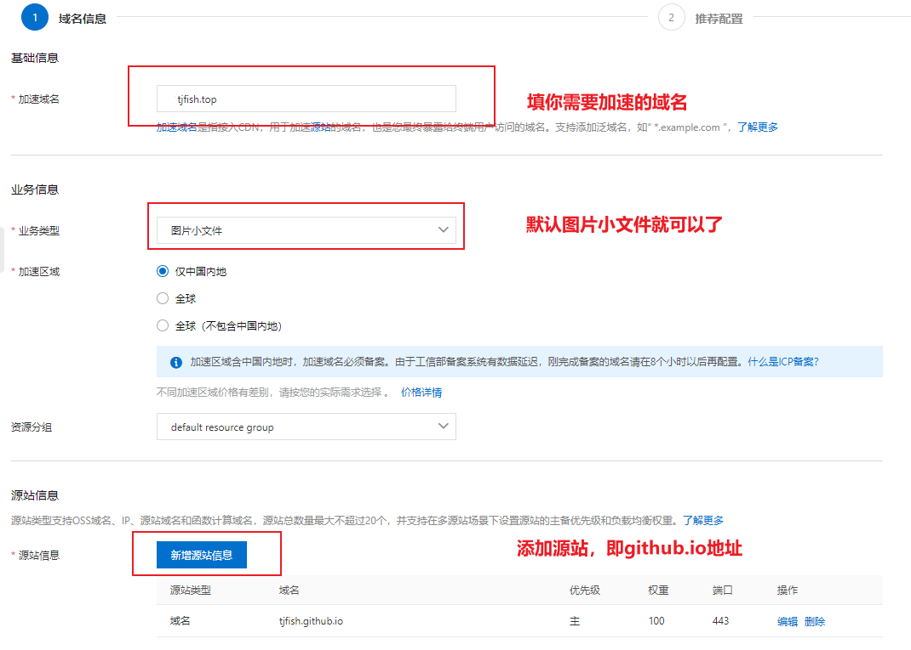
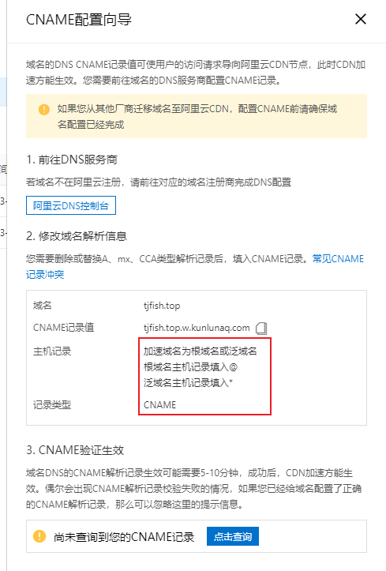
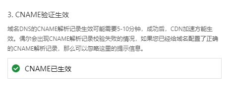
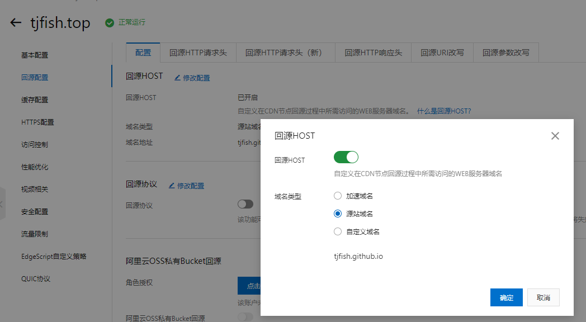
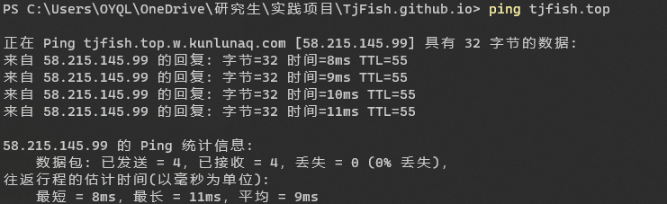

## 前置条件

- 绑定域名

  网上说得很多，可以参考这一条[知乎](https://links.jianshu.com/go?to=https%3A%2F%2Fwww.zhihu.com%2Fquestion%2F31377141)配置。

- 域名备案

  使用CDN要求域名必须备案，这一步可能要3天左右。备案在[阿里云备案](https://links.jianshu.com/go?to=https%3A%2F%2Fbeian.aliyun.com%2F%3Fspm%3D5176.8142029.388261.5.e9396d3eZBwXaF)。

下文的`你的域名`均指你申请的域名，而不是xxx.github.io，这个称为gitpages域名。

## 配置阿里云CDN加速

首先开通阿里云CDN，链接在此 [阿里云CDN](https://www.aliyun.com/product/cdn?userCode=0oplzj9q)

**创建加速域名**

然后进入CDN控制台，点击创建我的CDN，具体配置如下图。

加速域名根据你实际情况填写，如果你博客绑定在某个子域名上，就填你的子域名(如`blog.tjfish.top`)，

像我域名下只有一个博客，所以我这里填写根域名`tjfish.top` 

**点击新增源站**

源站信息 里选 **源站域名**

域名设置成你对应的 **XXXXXX.github.io**（如我的tjfish.github.io)

端口根据GitHub Pages`Enforce HTTPS`状态，如果勾中填 **443端口**，未勾中填 **80端口**。如下图：

**等待审核**

创建成功后会需要阿里云审核，大概5min

**配置DNS解析**

过一会儿你会获得一个CNAME。复制这个CNAME，去控制台->域名下修改域名解析。

记录类型填写**CNAME**，注意分清楚你是**根域名还是子域名**加速。可以按照阿里云给出的指导进行操作

配置后，可以查询CANME记录已经生效

**回源配置** **回源HOST** 选择 **源站域名** 之后保存，可能需要几分钟时间同步，等一下就好了

到这里就配置结束了，DNS生效大概需要10min才能看到效果。之后访问你的Github Page可以明显发现变快啦。

可以ping一下自己的域名，我的延迟就10ms左右

## 费用问题

阿里云CDN按流量计费费用如下，每GB 0.24元，如果Github Page访问量不大，基本等于免费。

