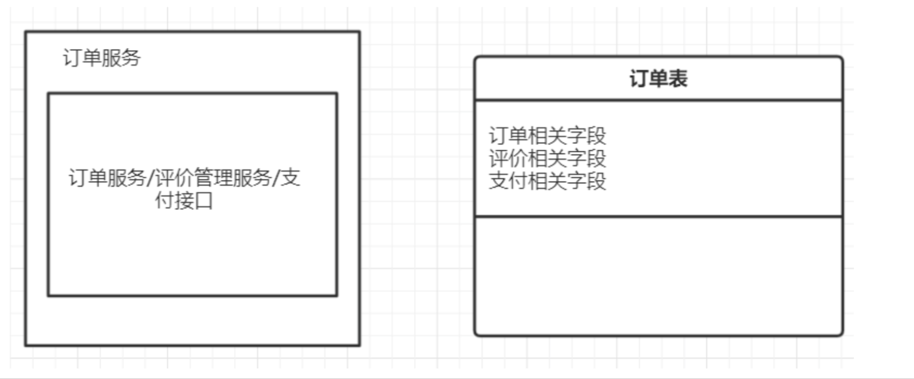
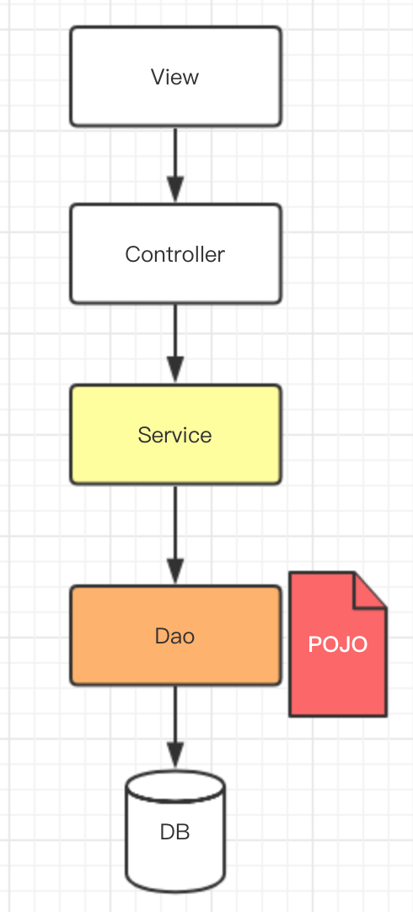
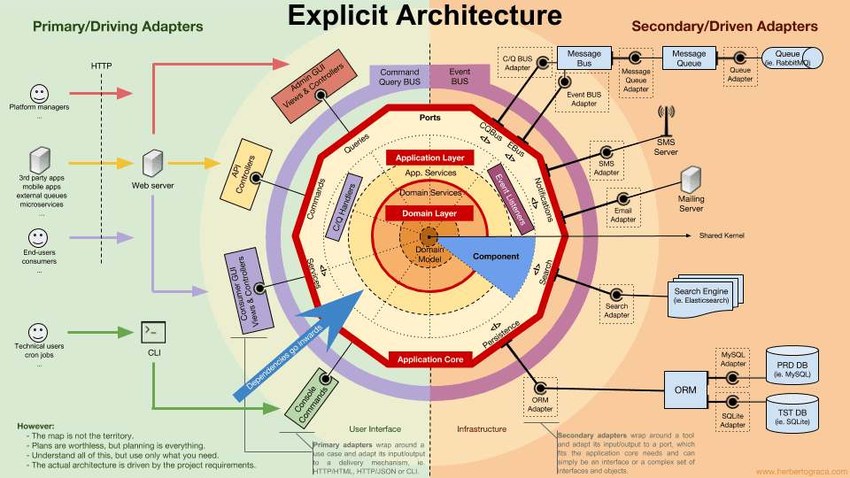

领域驱动设计的学习文章：

- [详解DDD系列 第一讲 - Domain Primitive ](https://tjfish.top/posts/殷浩详解DDD系列-第一讲-Domain-Primitive/)
- [详解DDD系列 第二讲 - 应用架构 ](https://tjfish.top/posts/殷浩详解DDD系列-第二讲-应用架构/)
- [详解DDD系列 第三讲 - Repository模式](https://tjfish.top/posts/殷浩详解DDD系列-第三讲-Repository模式/)
- [详解DDD系列 第四讲 - 领域层设计规范 ](https://tjfish.top/posts/殷浩详解DDD系列-第四讲-领域层设计规范/)
- [详解DDD系列 第五讲 - 聊聊如何避免写流水账代码 ](https://tjfish.top/posts/殷浩详解DDD系列-第五讲-聊聊如何避免写流水账代码/)
- [结合电商支付业务一文搞懂DDD](https://tjfish.top/posts/万字长文-结合电商支付业务一文搞懂DDD/)
- [CQRS与EventSourcing的架构设计 | TjFish](https://tjfish.top/posts/CQRS与EventSourcing/)
- [设计模式-何时使用继承？详细了解装饰器模式 | TjFish](https://tjfish.top/posts/设计模式-装饰器模式/)

## 领域驱动设计的概念

 	软件开发不是一蹴而就的事情，我们不可能在不了解产品(或行业领域)的前提下进行软件开发，在开发前通常需要进行大量的业务知识梳理，然后才能到软件设计的层面，最后才是开发。而在业务知识梳理的过程中，必然会形成某个领域知识，根据领域知识来一步步驱动软件设计，就是领域驱动设计(DDD,Domain-Driven Design)的基本概念 。

## 为什么需要 DDD

　在业务初期，功能大都非常简单，普通的 CRUD 就基本能满足要求，此时系统是清晰的。但随着产品的不断迭代和演化，业务逻辑变得越来越复杂，我们的系统也越来越冗杂。各个模块之间彼此关联，甚至到后期连相应的开发者都很难说清模块的具体功能和意图到底是啥。这就会导致在想要修改一个功能时，要追溯到这个功能需要修改的点就要很长时间，更别提修改带来的不可预知的影响面。 比如下图所示:

　　订单服务中提供了查询、创建订单相关的接口，也提供了订单评价、支付的接口。同时订单表是个大表，包含了非常多字段。我们在维护代码时，将会导致牵一发而动全身，很可能原本我们只是想改下评价相关的功能，却影响到了创建订单的核心流程。虽然我们可以通过测试来保证功能的完备性，但当我们在订单领域有大量需求同时并行开发时将会出现改动重叠、恶性循环、疲于奔命修改各种问题的局面，而且大量的全量回归会给测试带来不可接受的灾难。

　　但现实中绝大部分公司都是这样一个状态，然后一般他们的解决方案是不断的重构系统，让系统的设计随着业务成长也进行不断的演进。通过重构出一些独立的类来存放某些通用的逻辑解决混乱问题，但是我们很难给它一个业务上的含义，只能以技术纬度进行描述，那么带来的问题就是其他人接手这块代码的时候不知道这个的含义或者只能通过修改通用逻辑来达到某些需求。

## 领域模型追本溯源

　实际上，领域模型本身也不是一个陌生的单词，说直白点，在早期开发中，领域模型就是数据库设计。因为你想：我们做传统项目的流程或者说包括现在我们做项目的流程，都是首先讨论需求，然后是数据库建模，在需求逐步确定的过程不断的去变更数据库的设计，接着我们在项目开发阶段，发现有些关系没有建、有些字段少了、有些表结构设计不合理，又在不断的去调整设计，最后上线。在传统项目中，数据库是整个项目的根本，数据模型出来以后后续的开发都是围绕着数据展开，然后形成如下的一个架构：

很显然，这其中存在的问题如下：

- Service层很重，所有逻辑处理基本都放在service层。
- POJO作为 Service 层非常重要的一个实体，会因为不同场景的需求做不同的变化和组合，就会造成 POJO 的几种不同模型(失血、贫血、充血)，以此用来形容领域模型太胖或者太瘦。
- 随着业务变得复杂以后，包括数据结构的变化，那么各 个模块就需要进行修改，原本清晰的系统经过不断的演 化变得复杂、冗余、耦合度高，后果就非常严重。

　我们试想一下如果一个软件产品不依赖数据库存储设备，那我们怎么去设计这个软件呢？如果没有了数据存储，那么我们的领域模型就得基于程序本身来设计。那这个就是 DDD 需要去考虑的问题。

## DDD中的基本概念

### 实体（Entity）

　当一个对象由其标识(而不是属性)区分时，这种对象称为实体(Entity)。比如当两个对象的标识不同时，即使两个对象的其他属性全都相同，我们也认为他们是两个完全不同的实体。

### 值对象（Value Object）

　当一个对象用于对事物进行描述而没有唯一标识时，那么它被称作值对象。因为在领域中并不是任何时候一个事物都需要有一个唯一的标识，也就是说我们并不关心具体是哪个事物，只关心这个事物是什么。比如下单流程中，对于配送地址来说，只要是地址信息相同，我们就认为是同一个配送地址。由于不具有唯一标示，**我们也不能说"这一个"值对象或者"那一个"值对象。**

### 聚合及聚合根（Aggregate，Aggregate Root）

　聚合是通过定义领域对象之间清晰的所属关系以及边界来实现领域模型的内聚，以此来避免形成错综复杂的、难以维护的对象关系网。聚合定义了一组具有内聚关系的相关领域对象的集合，我们可以把聚合看作是一个修改数据的单元。

　聚合根属于实体对象，它是领域对象中一个高度内聚的核心对象。(聚合根具有全局的唯一标识，而实体只有在聚合内部有唯一的本地标识，值对象没有唯一标识，不存在这个值对象或那个值对象的说法)

　若一个聚合仅有一个实体，那这个实体就是聚合根；但要有多个实体，我们就要思考聚合内哪个对象有独立存在的意义且可以和外部领域直接进行交互。

### 领域服务（Domain Service）

　一些重要的领域行为或操作，它们不太适合建模为实体对象或者值对象，它们本质上只是一些操作，并不是具体的事物，另一方面这些操作又涉及到**多个领域对象**的操作，它们只负责来协调这些领域对象完成操作而已，那么我们可以归类它们为领域服务。它实现了全部业务逻辑并且通过各种校验手段保证业务的正确性。同时呢，它也能避免在应用层出现领域逻辑。

### 应用服务（Application Service）

​	很薄的一层，定义软件要完成的任务，类似于USE CASE，通过编排各类**领域服务**完成服务。对外为展现层提供各种应用功能（包括查询或命令），对内调用领域层（领域对象或领域服务）完成各种业务逻辑，应用层不包含业务逻辑。

### 工厂（Factory）

　DDD中的工厂也是一种封装思想的体现。引入工厂的原因是：有时创建一个领域对象是一件相对比较复杂的事情，而不是简单的new操作。工厂的作用是隐藏创建对象的细节。事实上大部分情况下，领域对象的创建都不会相对太复杂，故我们仅需使用简单的构造函数创建对象就可以。隐藏创建对象细节的好处是显而易见的，这样就可以不会让领域层的业务逻辑泄露到应用层，同时也减轻应用层负担，它只要简单调用领域工厂来创建出期望的对象就可以了。

### 仓储（Repository）

　Repository封装了基础设施来提供查询和持久化聚合操作。这样能够让我们始终关注在模型层面，把对象的存储和访问都委托给资源库来完成。DDD 关心的是领域内的模型，而不是数据库的操作。

​	这种常见的设计模式叫做Anti-Corruption Layer（防腐层或ACL），防腐层是领域层与基础设施之间的桥梁。很多时候我们的系统会去依赖其他的系统，而被依赖的系统可能包含不合理的数据结构、API、协议或技术实现，如果对外部系统强依赖，会导致我们的系统被”腐蚀“。这个时候，通过在系统间加入一个防腐层，能够有效的隔离外部依赖和内部逻辑，无论外部如何变更，内部代码可以尽可能的保持不变。

## 程序设计中DDD的分层结构

DDD是一种建模思想，在实际程序设计中也可以对DDD的各类概念进行分层。虽然是分层结构，但是我更推荐称其为**六边形结构**，如下图。

按照层次划分，各类DDD基本概念可以被分到如下层次中

### 领域层（Domain Layer）

领域建模中最重要的一层，包含所有领域知识和领域规则。

- 实体 Entity
- 值对象 Value Object
- 聚合根 Aggregate
- 领域服务 Domain Service
- 工厂 Factory

### 应用层（Application Layer）

定义应用的功能，复杂编排各类领域服务和基础服务完成应用功能。

- 应用服务 Application Service

### 基础设施层（Infrastructure Layer）

提供基础设施能力，这些能力不属于本系统领域所关注的。如数据存储、邮件发送、日志管理等

- 防腐层（Anti-Corruption Layer）
  - 存储 Repository
  - 其他基础服务 Infrastructure Service 
- 各类基础服务具体实现
  - 数据库
  - 外部第三方系统 

### 接口层（Interface Layer）

为外部应用提供统一的接口，属于应用的门面Facade。调用应用层完成请求处理。

- 网页前端接口 Web Controller
- 内部服务接口 Thrift Controller