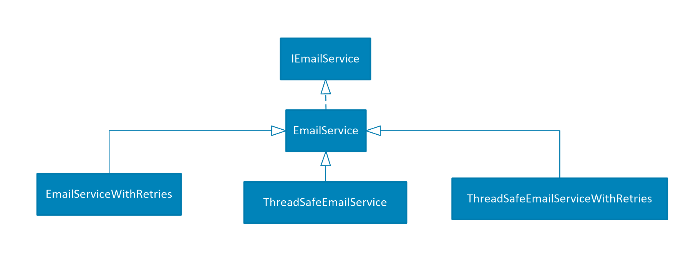
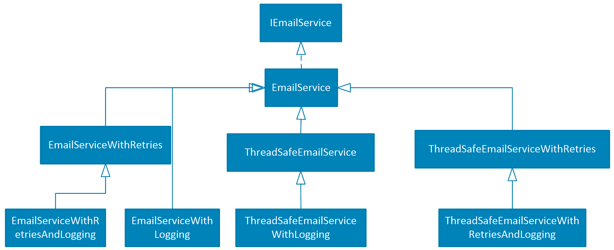
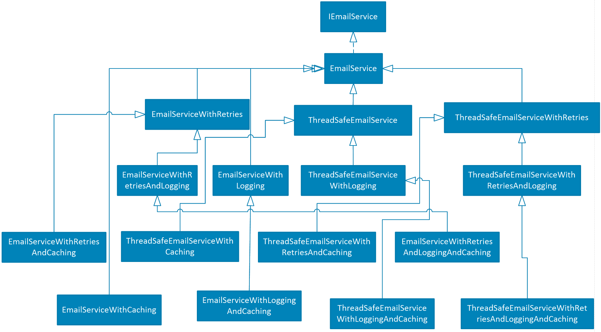
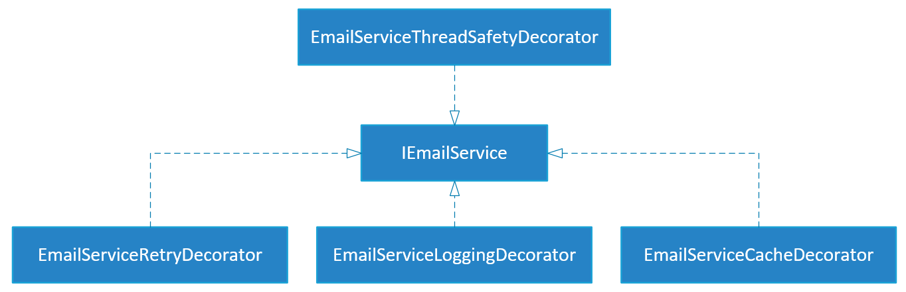

面向对象编程时，继承是用于扩展对象功能的主要模式。今天，继承开始被认为是一种[设计异味](https://www.google.com/search?q=design+smell&sourceid=chrome&ie=UTF-8)。事实上，已经证明使用继承来扩展对象通常会导致类层次结构爆炸。此外，Java 和 C# 等几种流行的编程语言不支持多重继承，这限制了这种继承的拓展。

面向对象编程时，继承是用于扩展对象功能的主要模式。今天，继承开始被认为是一种设计异味。事实上，已经证明使用继承来扩展对象通常会导致类层次结构爆炸。此外，Java 和 C# 等几种流行的编程语言不支持多重继承，这限制了这种继承的拓展。


在面向对象编程时，继承是一种经常用于扩展对象功能的方法。然而时至今日，随着设计模式的发展，继承开始被认为是一种[设计异味](https://zh.wikipedia.org/wiki/%E8%AE%BE%E8%AE%A1%E5%BC%82%E5%91%B3)。事实上，已经证明使用继承来扩展对象通常会导致类层次结构爆炸。此外，Java 和 C# 等几种流行的编程语言不支持多重继承，这限制了继承的拓展。

装饰器模式为扩展对象功能提供了一种灵活的继承替代方案。这种设计模式的方法是多个**装饰器**可以堆叠在一起，每个装饰器都添加新的功能。与继承相比，装饰器可以对某个单独接口进行拓展，从而避免了对整个类层次结构进行子类化。此外，使用装饰器模式可以生成干净且可测试的代码（请参阅 **可测试**性和**其他优点**章节）。

遗憾的是，今天的大部分软件开发人员对装饰器模式的理解有限。这一部分是由于缺乏相关的培训，另一部分也是因为编程语言没有跟上面向对象设计原则的发展，以鼓励开发人员学习和使用装饰器模式。

本文将讨论使用装饰器模式相对于继承的优点，并建议在面向对象的编程语言中，装饰器模式应该具有原生支持。事实上，相比于继承，我相信装饰器模式可以编写更干净和可测试的代码。

## 继承带来的类层次结构爆炸

当向给定的类层次结构添加新功能所需的类数量呈指数增长时，就会出现类层次结构的爆炸式增长。让我们考虑以下接口：

```java
public interface IEmailService
{
    void send(Email email);
    Collection<EmailInfo> listEmails(int indexBegin, int indexEnd);
    Email downloadEmail(EmailInfo emailInfo);
}
```

如果对电子邮件服务器的请求失败， *EmailService*的默认实现会引发异常。我们想扩展*EmailService*实现，以便在放弃之前重试失败的请求几次。我们还希望能够选择实现是否是线程安全的。

我们可以通过向*EmailService*类本身添加可选的重试和线程安全特性来实现这一点。该类将接受构造函数中启用/禁用每个功能的参数。然而，这种解决方案违反了[单一职责原则](https://en.wikipedia.org/wiki/Single_responsibility_principle)（因为*EmailService*将有额外的责任）和[开闭原则](https://en.wikipedia.org/wiki/Open/closed_principle)（因为必须修改类本身以进行扩展）。此外，*EmailService*类可能是我们无法修改的第三方库的一部分。

在不修改类的情况下扩展类的常用方法是使用继承。通过继承，派生类继承其父类的属性和行为，并且可以选择扩展或覆盖其某些功能。在*EmailService*示例中，我们可以创建三个子类，一个添加重试，一个添加线程安全，一个添加两个功能。类层次结构如下所示：



请注意，*ThreadSafeEmailServiceWithRetries*也可以从*EmailServiceWithRetries*或*ThreadSafeEmailService*继承（如果支持多重继承，则两者都继承）。但是，类的数量和产生的功能将是相似的。

除了重试和线程安全之外，我们还想扩展我们的电子邮件服务 API，以便可以选择启用日志记录。再次，我们使用继承来扩展类层次结构，如下所示：



请注意，添加对日志记录的支持所需的附加类的数量等于现有层次结构中的类总数（在本例中为四个）。为了确认这种行为，让我们将缓存添加到层次结构并检查结果。新的层次结构如下所示：



如您所见，类层次结构呈指数级增长，并且很快变得难以管理。这个问题被称为***类层次结构爆炸***。

## 装饰者模式的解决方案

装饰器模式使用组合而不是继承来扩展对象功能。它消除了类层次结构爆炸的问题，因为每个新特性只需要一个装饰器。为了说明，让我们为重试功能创建一个装饰器。为简单起见，使用了一个简单的 for 循环重试3 次。EmailServiceRetryDecorator*如下*：

```java
public class EmailServiceRetryDecorator implements IEmailService
{
    private final IEmailService emailService;

    public EmailServiceRetryDecorator(IEmailService emailService) {
        this.emailService = emailService;
    }

    @Override
    public void send(Email email) {
        executeWithRetries(() -> emailService.send(email));
    }

    @Override
    public Collection<EmailInfo> listEmails(int indexBegin, int indexEnd) {
        final List<EmailInfo> emailInfos = new ArrayList<>();
        executeWithRetries(() -> emailInfos.addAll(emailService.listEmails(indexBegin, indexEnd)));
        return emailInfos;
    }

    @Override
    public Email downloadEmail(EmailInfo emailInfo) {
        final Email[] email = new Email[1];
        executeWithRetries(() -> email[0] = emailService.downloadEmail(emailInfo));
        return email[0];
    }

    private void executeWithRetries(Runnable runnable) {
        for(int i=0; i<3; ++i) {
            try {
                runnable.run();
            } catch (EmailServiceTransientError e) {
                continue;
            }
            break;
        }
    }
}
```

请注意，EmailServiceRetryDecorator 的构造函数*引用*了*IEmailService，*它可以是*IEmailService*的任何实现（包括装饰器本身）。*这将装饰器与IEmailService*的特定实现完全分离，并增加了它的可重用性和可测试性。同样，我们可以为线程安全、日志记录和缓存创建装饰器。生成的类层次结构如下：



如上面的类图所示，每个特性只需要一个类，并且生成的类层次结构简单且可扩展（线性增长）。

### 装饰器队列

乍一看，使用装饰器模式似乎只能将一个功能添加到给定的实现中。然而，因为装饰器可以堆叠在一起，所以可能性是无穷无尽的。例如，我们可以动态地创建一个等价于我们使用继承创建的*EmailServiceWithRetriesAndCaching*，如下所示：

```java
IEmailService emailServiceWithRetriesAndCaching = new EmailServiceCacheDecorator(
  new EmailServiceRetryDecorator(new EmailService()));
```

此外，通过更改装饰器的顺序或在多个级别使用相同的装饰器，我们可以动态地创建新的实现，而这些实现是通过继承难以创建的。例如，我们可以在重试之前和之后添加日志记录，如下所示：

```java
IEmailService emailService = new EmailServiceLoggingDecorator(new EmailServiceRetryDecorator(
        new EmailServiceLoggingDecorator(new EmailService())));

```

通过这种组合，将记录重试前后的请求状态。这提供了详细的日志记录，可用于调试目的或创建丰富的仪表板。

另请参阅 -decorator [-builder](https://dzone.com/articles/the-decorator-builder) 模式，它使组合装饰器更简单、更易读。

### 可测试性

装饰器相对于继承的另一个主要好处是可测试性。为了说明，让我们考虑为重试功能编写一个单元测试。

我们通过继承创建的*EmailServiceWithRetries*无法独立于其父类（*EmailService*）进行测试，因为没有机制可以用存根（也称为模拟）替换父类。此外，因为 *EmailService* 对后端服务器执行网络调用，它的所有子类都变得难以进行单元测试（因为网络调用通常很慢且不可靠）。在这种情况下，通常使用集成测试而不是单元测试。

另一方面，因为*EmailServiceRetryDecorator*在其构造函数中引用了*IEmailService*，所以装饰对象可以很容易地替换为存根实现（即模拟）。这使得可以单独测试重试功能，而继承是不可能的。为了说明这一点，让我们编写一个单元测试来验证是否执行了至少一次重试（在此示例中，我使用 Mockito 框架创建了一个存根）。

```java
// Create a mock that fails the first time and then succeed
IEmailService mock = mock(IEmailService.class);
when(mock.downloadEmail(emailInfo))
        .thenThrow(new EmailServiceTransientError())
        .thenReturn(email);

EmailServiceRetryDecorator decorator = new EmailServiceRetryDecorator(mock);
Assert.assertEquals(email, decorator.downloadEmail(emailInfo));
```

与依赖于*EmailService*实现和远程服务调用的集成测试相比，该测试更简单、快速且可靠。

### 其他优点

除了简化类层次结构和提高可测试性之外，装饰器模式还鼓励开发人员编写符合[SOLID 设计原则的代码。](https://en.wikipedia.org/wiki/SOLID_(object-oriented_design))事实上，使用装饰器模式，新特性被添加到新的焦点对象（[单一责任原则](https://en.wikipedia.org/wiki/Single_responsibility_principle)）而不修改现有类（[开闭原则](https://en.wikipedia.org/wiki/Open/closed_principle)）。此外，装饰器模式鼓励使用[依赖倒置](https://en.wikipedia.org/wiki/Dependency_inversion_principle)（这有很多好处，例如松耦合和可测试性），因为装饰器依赖于抽象而不是具体化。

### 缺点

尽管装饰器模式与替代方案（继承或修改现有类）相比具有许多优点，但它几乎没有阻碍其采用的缺点。

这种模式的一个已知缺点是装饰接口中的所有方法都必须在装饰器类中实现。事实上，不添加任何额外行为的方法必须实现为转发方法以保持现有行为。相反，继承只需要子类来实现改变或扩展基类行为的方法。

为了说明转发方法的问题，让我们考虑下面的*IProcess*接口并为其创建一个装饰器。

```java
public interface IProcess 
{
    void start(String args);
    void kill();
    ProcessInfo getInfo();
    ProcessStatus getStatus();
    ProcessStatistics getStatistics();
}
```

如果进程启动失败，*start*方法的默认实现会抛出*FailedToStartProcessException 。*我们想扩展默认实现，以便在放弃之前重试启动进程三遍。使用装饰器模式，实现将如下所示：

```java
public class RetryStartProcess implements IProcess
{
    private IProcess process;

    public RetryStartProcess(IProcess process) {
        this.process = process;
    }

    @Override
    public void start(String args) {
        for(int i=0; i<3; ++i) {
            try {
                process.start(args);
            } catch (FailedToStartProcessException e) {
                continue;
            }
            break;
        }
    }

    @Override
    public void kill() {
        process.kill();
    }

    @Override
    public ProcessInfo getInfo() {
        return process.getInfo();
    }

    @Override
    public ProcessStatus getStatus() {
        return process.getStatus();
    }

    @Override
    public ProcessStatistics getStatistics() {
        return process.getStatistics();
    }
}
```

请注意，此实现包含大量样板代码。事实上，唯一相关的实现部分是*start*方法的实现。对于具有许多方法的接口，这种样板可以被视为生产力和维护开销。

装饰器模式的另一个缺点是它不受欢迎，尤其是在初级开发人员中。事实上，不太受欢迎通常意味着更难理解哪些会导致开发时间变慢。

## 对装饰器模式的原生支持

如果装饰器模式受益于面向对象编程语言的原生支持（类似于今天为继承提供的支持），则可以克服上一节中讨论的两个缺点。事实上，有了这样的原生支持，就不需要转发方法，装饰器模式也更容易使用。此外，对装饰器模式的原生支持肯定会增加其流行度和使用率。

编程语言如何影响设计模式的采用的一个很好的例子是在 C# 中引入了对观察者模式（也称为[事件](https://msdn.microsoft.com/en-us/library/awbftdfh.aspx)）的本机支持。今天的 C# 开发人员（包括初级开发人员）自然而然地使用观察者模式在松散耦合的类之间进行事件通信。如果 C# 中不存在事件，许多开发人员会在类之间引入直接依赖关系来传递事件，这将导致代码的可重用性降低并且更难测试。类似地，对装饰器模式的原生支持将鼓励开发人员创建装饰器，而不是修改现有类或不恰当地使用继承，这将导致更好的代码质量。

以下实现说明了 Java 中对装饰器模式的原生支持：

```java
public class RetryStartProcess decorates IProcess
{
    @Override
    public void start(String args) {
        for(int i=0; i<3; ++i) {
            try {
                decorated.start(args);
            } catch (FailedToStartProcessException e) {
                continue;
            }
            break;
        }
    }
}
```

请注意用于代替*implements的**decorates*关键字，以及使用*修饰*字段来访问修饰对象。为此，装饰器的默认构造函数需要一个*IProcess*参数（将在语言级别处理，就像今天处理无参数默认构造函数一样）。如您所见，这种原生支持将使装饰模式样板免费，并且与继承一样容易实现（如果不是更容易的话）。

## 抽象装饰器

如果像我一样，你经常使用装饰器模式并且经常为每个接口使用许多装饰器，那么你可以使用一种解决方法来减少转发方法的样板文件（与此同时，直到对装饰器的原生支持模式变为可用）。解决方法包括创建一个抽象装饰器，该装饰器将所有方法实现为转发方法，并从中派生（继承）所有装饰器。因为转发方法继承自抽象装饰器，所以只有装饰方法需要重新实现。此解决方法利用了对继承的本机支持并使用它来实现装饰器模式。以下代码说明了这种方法。

```java
public abstract class AbstractProcessDecorator implements IProcess
{
    protected final IProcess process;

    protected AbstractProcessDecorator(IProcess process) {
        this.process = process;
    }

    public void start(String args) {
        process.start(args);
    }

    public void kill() {
        process.kill();
    }

    public ProcessInfo getInfo() {
        return process.getInfo();
    }

    public ProcessStatus getStatus() {
        return process.getStatus();
    }

    public ProcessStatistics getStatistics() {
        return process.getStatistics();
    }
}
```


```java
public class RetryStartProcess extends AbstractProcessDecorator
{
    public RetryStartProcess(IProcess process) {
        super(process);
    }

    @Override
    public void start(String args) {
        for(int i=0; i<3; ++i) {
            try {
                process.start(args);
            } catch (FailedToStartProcessException e) {
                continue;
            }
            break;
        }
    }
}
```

这种方法的一个缺点是装饰器将无法从其他类继承（对于不支持多重继承的语言，如Java）。

## 何时使用继承

尽管我认为应该尽可能选择装饰器模式而不是继承，但在某些情况下继承更合适。装饰器不适用的常见情况是：派生类需要访问父类中的非公共字段或方法。因为装饰器只知道公共接口，所以它们无法访问特定于一个实现或另一个实现的字段或方法。

根据经验，如果您的子类仅仅依赖于其父类的公共接口，则暗示着可以改用装饰器模式。事实上，如果静态分析工具建议在这种情况下用装饰器替换继承，那就太好了。

## 总结

- 在可能的情况下，装饰器模式应该优先于继承。
- 装饰器模式消除了继承遇到的类层次结构爆炸的问题。事实上，使用装饰器模式，生成的类层次结构很简单并且可以线性扩展。
- 装饰器可以独立于装饰对象进行测试，但子类不能独立于其父类进行测试。通过继承，如果父类难以进行单元测试（例如执行远程调用），则其派生类会继承此问题。但是，由于装饰器只依赖于装饰对象的接口（通过装饰器类的构造函数注入），所以装饰器可以独立进行单元测试。
- 装饰器模式的使用鼓励开发人员编写符合 SOLID 设计原则的代码。
- 面向对象编程语言中对装饰器模式的原生支持将使该模式更易于使用并增加其采用率。

