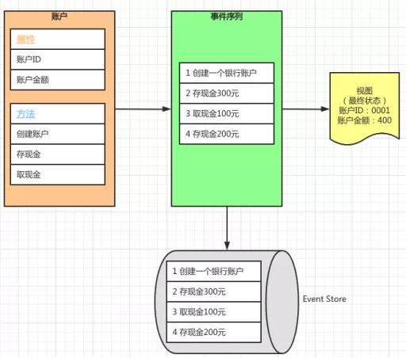

随着业务不断发展，软件系统的架构也越来越复杂，但无论多复杂的业务最终在系统中实现的时候，无非是读写操作。用户根据业务规则写入商业数据，再根据查询规则获取想要的结果。通常而言我们会讲这些读写的数据放到一个数据库中保存，通过一套模型对其进行读写操作。而在大型系统中往往查询操作远远多于写入操作，于是就有了读写分离的思想，将读操作和写操作的模型分开定义并且提供不同的通道供用户使用。CQRS(Command-Query Responsibility Segregation) 就是基于这一思想提供的一种模式读写分离的模式。

## **传统模式**

传统的系统请求从最左边的Client开始，沿着红线往右通过Application Service对系统进行请求。这里Application Service 可以理解为系统的门面，或者是Controller层负责接收客户端的请求，此时请求的内容比较简单基本和数据库中的信息一致，因此这里使用DTO(Data Transfer Object)直接请求。DTO经过Domain Model 以后直接到达Database，从而沿着蓝色的线条返回给Client端。传统的请求方式部分读操作和写操作，都使用同样的数据模型和一套Domain Model以及相同的数据库。

传统模式在系统庞大后存在几点问题

- DTO会逐渐变得臃肿，面面俱到
- Domain Model 读写的数据模型不一样，导致读写逻辑混杂在一起

## **CQRS模式**

将读写分离，客户端的请求分为两类，一类为Command，为写入操作。一类为Query，为只读操作。

这样的好处是，分离读写职责，模型界限明确。

随着系统规模扩大，将读库和写库分离是必然的选择，例如现在的分布式系统，多库读写。但这会带来数据一致性的问题，这个问题的解决就可以靠**Event Sourcing **模式。

## **Event Sourcing 模式**

Event Sourcing的思想是**记录变更过程而非最终结果**。把所有写入操作（也叫事件）记录下来，通过事件形成的序列可以计算出数据的最终状态。任何实体的最终状态都是通过事件的叠加和还原确认的

Event Sourcing 的优点：

- 溯源事件与重现操作：天然支持审计，事件序列就是一条条的审计日志。
- 追踪和修复Bug：有着所有历史数据，修复Bug造成的影响小。
- 提高性能：提高写入性能，只有新增，没有删除更新操作，适合日志型数据库。

**Event Sourcing 的缺点：**

- 转变思路：首先需要按照领域建模思想，将系统的操作都建模为一个个事件。这有一定技术难度。
- 兼容性问题：当系统发展，事件的数据结构会发生变化，如何去兼容历史事件。
- 处理幂等事件：事件需要保持幂等性，即执行多次的结果仍然一样。
- 数据库存储：将所有事件存储下来，数据库的容量膨胀的很快。

## **CQRS与Event Sourcing的结合**

将读写分离的CQRS和Event Sourcing结合起来。Command作为写入操作，形成一个个事件，Event Store保存事件，并将事件发送给读库。读库根据事件更新数据状态。Query端查询读库获取最新的数据状态。

## **什么时候使用Event Sourcing**

使用Event Sourcing有它的优点也有缺点，那么什么时候该使用Event Sourcing模式呢？

1. 首先是系统类型，如果你的系统有大量的CRUD，也就是增删改查类型的业务，那么就不适合使用Event Sourcing模式。Event Sourcing模式比较适用于有复杂业务的应用系统。
2. 如果对你的系统来说，业务数据产生的过程比结果更重要，或者说更有意义，那就应该使用Event Sourcing。你可以使用Event Sourcing的事件数据来分析数据产生的过程，解决bug，也可以用来分析用户的行为。
3. 如果你需要系统提供业务状态的历史版本，例如一个内容管理系统，如果我想针对内容实现版本管理，版本回退等操作，那就应该使用Event Sourcing。

参考文章https://www.51cto.com/article/644144.html